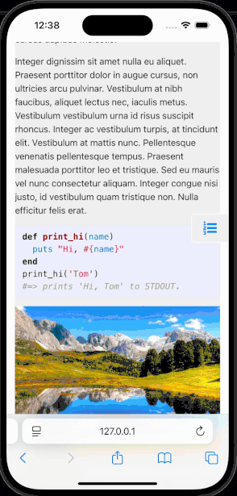
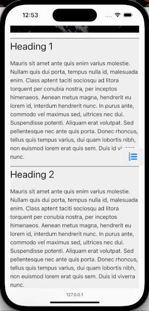

# jekyll-side-bar

> [!NOTE]
> Head to [jekyll-side-bar.szonov.com](http://jekyll-side-bar.szonov.com) to see a live demo of this plugin!


## Introduction

This repository hosts code for a plugin for [Jekyll based sites](https://jekyllrb.com/) that adds a sidebar to your regular blog post. The plugin is simple to use. This plugin allows for multiple sidebars within a single blog post page. This has been tested with Jekyll's minima theme.


The sidebar feature allows for better organization and more beautiful presentation of information. By default, presenting long form content with the minima theme can appear boring to the user. The boring nature limits user retention and interest. The author is not just interested in presenting content, but to have the reader enjoy it and consume it fully.

 By adding a sidebar, the user will know where they are in the long text and where they are going - this allows for a parallel form of information - like a compass on a map. In the age of short attention spans this compass is not only a navigation tool, but also a nice visual fidget toy for the viewer.
  
 In addition, the sidebar can be used multiple times within a single blog post and is distinct from regular text as the sidebar reduces the content's width. The alternating width adds 'hills' to the content which makes the readers's walk through your page a pleasant hike.

Finally, the elements selected by the author to be as headers in the sidebar allow the authors to emphasize the points the reader nees to care about. The reader may forget all the words in your write up, but they will remember the points. 


## How to use

### 1. Import the plugin

Copy the plugin folder `jekyll-side-bar` from this repositories [`lib`](https://github.com/mannyray/jekyll-side-bar/tree/master/lib) into your Jekyll based site's `_plugins` folder. 

### 2. Import a custom font

This font is the "table of contents" emoji used as part of the sidebar's display. Originally, the font is from

```
https://cdnjs.cloudflare.com/ajax/libs/font-awesome/4.7.0/css/font-awesome.min.css
```

but it was decided to (a) make this repository's code self contained by preventiong importing from another website and (b) use a font with just one symbol instead of all of the symbols provided by font awesome to reduce the data to be downloaded to viewer's page.

Copy from the root of this repository the `content_font` folder in to the `css` folder located in the root directory of your Jekyll site. 

### 3. Modify your post layout

Your markdown blog posts will have have a header section like the following

```
---
layout: post
title:  "Welcome to Jekyll!"
date:   2022-11-11 16:27:06 -0600
categories: jekyll update
---
```

Due to the layout being `post`, make sure your modify your `post.html` in your [layout directory](https://jekyllrb.com/docs/step-by-step/04-layouts/) to filter the `content` via `| toc` operation since this plugin is a [filter](https://jekyllrb.com/docs/plugins/filters/). Here is a `before` / `after` for a sample layout page (yours may be different).


<table>
<tr>
<td> Before </td> <td> After </td>
</tr>
<tr>
<td>


```html
---
layout: default
---
<div class="post">
    <article class="post-content">
        {{ content }}
    </article>
</div>
```

</td>
<td>
    
```html
---
layout: default
---
<div class="post">
    <article class="post-content">
        {{ content | toc }}
    </article>
</div>
```
</td>
</tr>
</table>


### 4. Modify your content

Wrap your content that you want to be part of the sidebar with `<!--toc_start-->` and `<!--toc_end-->`. All lines that are wrapped that are `h2` headings (e.g. `## Another day, another heading`) will be made into a link in the sidebar. `<!--toc_start-->` must be followed by a `h2` heading line. The following section below will be modified into the following image. 

```
<!--toc_start-->

## Just another heading 

...

## A heading

...


def print_hi(name)
  puts "Hi, #{name}"
end
print_hi('Tom')
#=> prints 'Hi, Tom' to STDOUT.



<!--toc_end-->
```


## Features and demonstrations

To get a live demonstration then go to the `test_site` directory and run `jekyll serve` in the terminal. Otherwise, check out the gifs below:


| Features    | Demonstration |
| -------- | ------- |
 | A sidebar can be added in between regular content. The sidebar minizes the content width, but adds a compass for navigation. You can have multiple sidebars throughout your blog post. The sidebar content can contain code/image/text.  |    | 
| You can use the sidebar to jump around. The highlighted/active link in the sidebar shows where you are currently located at.  |  |
| You can also have long sidebars. The sidebar gets its own scrollbar which auto adjusts when the page's scrollbar is scrolled to an `h2` heading that is not visible in the sidebar  |  |
| In mobile view, there is a button on the side of the screen. When pressed it shows you the sidebar with your current section highlighted. The text that is organized with the sidebar has a grey background to differentiate to non sidebar content. | <div style="height:50%"></div>  |
| In mobile view, the sidebar dissapears upon scrolling or pressing something outside the sidebar (or if pressing the sidebar's "x" button.) It can be used for navigating to links you are interested in. |  |
| In mobile view, long sidebars auto adjust when your current scroll position on the page is viewing a header outside    |  | 


